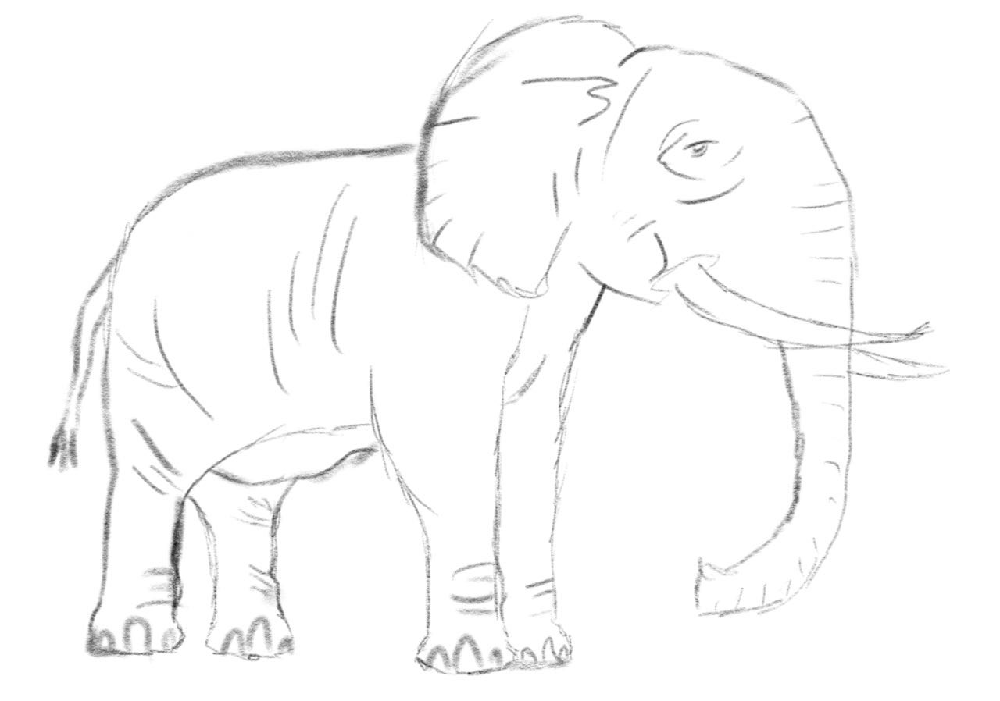

# Line Art to 3D with MistoLine & TripoSR

<p align="center">
  
  
  
</p>

Welcome to the repository for the Sketch to 3D Project, where the cutting-edge capabilities of MistoLine and TripoSR help to transform line art sketches into detailed 3D models. This project showcases the integration of advanced AI technologies to revolutionize digital art and design.
## Overview

This project utilizes:
- **MistoLine**: A versatile AI model that converts line art into high-resolution images.
- **TripoSR**: A state-of-the-art 3D generative model that transforms 2D images into 3D models.

## Installation

To set up this project locally, follow these steps:
```bash
git clone https://github.com/bohdanvodianyk/line-art-to-3d.git
cd line-art-to-3d
pip install -r requirements.txt
```
## Usage
After installation, you can start converting your line art into 3D models by running the following commands:
# MistoLine:
1) Describe your ```prompt``` and ```negative_prompt```.
2) Define ```input``` and ```output``` paths.
3) ```Run``` the script.

# TripoSR:
1) Put the necessary images into the input folder.
2) Run in cmd:
```python RunTripoSR.py path_to_input_image --output-dir path_to_output_folder```

## Examples
Check out the examples ```input-LineArt/output-LineArt``` and ```input-TripoSR/output-TripoSR``` folders for before and after images and 3D models to see what MistoLine and TripoSR can do.

## Papers and Research
Learn more about the technologies used in this project:
- ControlNet paper: https://arxiv.org/abs/2302.05543
- TripoSR paper: https://arxiv.org/abs/2403.02151

## Connect
For more updates and related works, connect with me on LinkedIn:
www.linkedin.com/in/bohdan-vodianyk

## Acknowledgments
Thanks to all the contributors and researchers who have made the MistoLine and TripoSR models accessible, facilitating groundbreaking advancements in digital arts.
